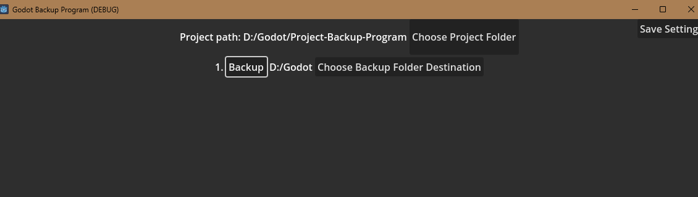

Use the top button to choose the project you are backing up
Choose your backup folder destination
Click save settings at the top right to preserve these changes
Click backup to initiate a backup in the destination you chose
